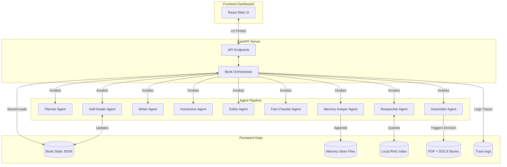
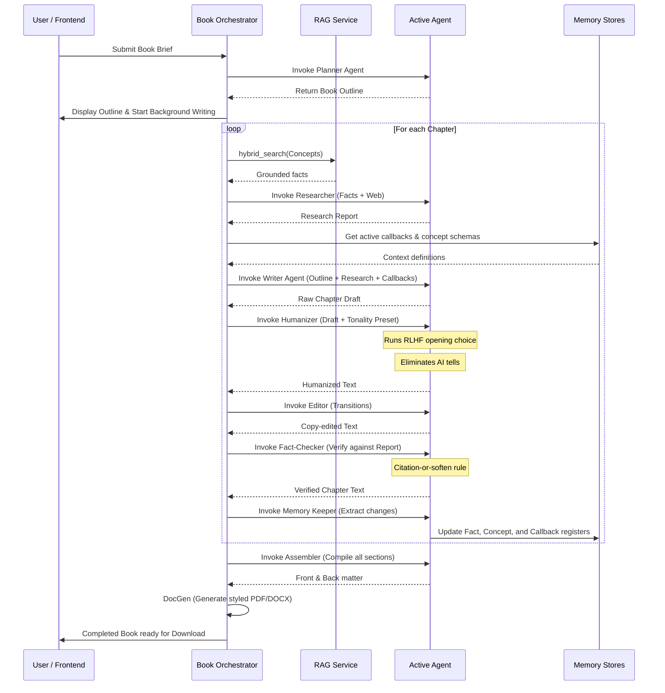

# AIuthor — System Architecture

This document describes the architectural topology, memory systems, and execution flows of the AIuthor book writer agentic system.

---

## 1. Agent Topology

AIuthor operates as an event-driven **orchestrator-worker pipeline** where a central State Machine manages the overall progress, and specific agents are invoked sequentially or conditionally based on execution status.

---

## 2. Memory Architecture

A single context window is never stuffed with previous chapters. Instead, AIuthor maintains structured, queryable files for the book memory:

1. **Fact Registry**: A cumulative ledger of verified facts, statistics, and calculations. Extracted by the Memory Keeper and checked by the Fact-Checker.
2. **Concept/Character Bible**: A registry of terms, characters, and descriptions. Ensured by the Writer for consistency.
3. **Callback Index**: Log of narrative milestones or milestones to refer back to (e.g. "Char X did Y in Ch. 1").
4. **Tonality Fingerprint**: Style guidelines, custom rules, and vocabulary choices cascading through all book surfaces.
5. **Decision Log**: Audit log of creative decisions made during the writing loop.

---

## 3. Data Flow

---

## 4. Failure Paths & Recovery

1. **LLM API Failures**:
   - If a call to `gemini-2.5-pro` fails (e.g. rate limit, content block), the `LLMService` automatically falls back to `gemini-2.5-flash` or `gemini-1.5-flash` to continue execution.
   - If both fail, it can fall back to OpenAI API keys if provided.
2. **Fact Discrepancies**:
   - If the Fact-Checker detects ungrounded assertions, it either softens the statements using hedges ("some sources argue...") or triggers the *abstention rule*, omitting the claim to prevent hallucinations.
3. **Downstream Insertion (Test Case D)**:
   - When a chapter is inserted, the outline is restructured, and the orchestrator shifts subsequent chapter numbers.
   - It runs the standard pipeline for the new chapter.
   - It then invokes the `SelfHealer` editor on all downstream chapters, scanning their texts and rewriting hardcoded chapter numbers (e.g. changing "Chapter 5" references to "Chapter 6") and integrating callbacks relative to the new chapter.
